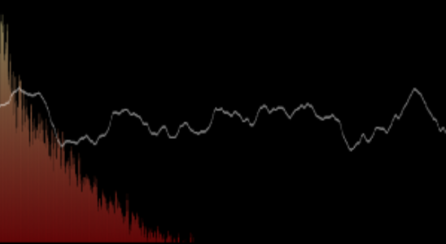

# Web Audio API - experiments

Some investigations of the Web Audio API using HTML and vanilla Javascript.

## Usage

I wrote this using node 12.7.0, but you would probably get away with previous LTS.

This project uses `live-server` to serve the HTML and immediately reload to reflect any changes.

Just install the dependencies and then run `npm start`

```javascript
npm install
npm start
```

## Analyser

Load a waveform from disk, or the provided default oscillator, to see the frequency and time domain plots.



## PeriodicWave
